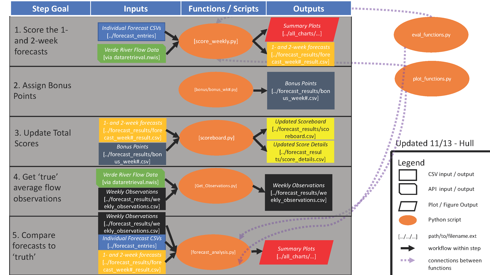
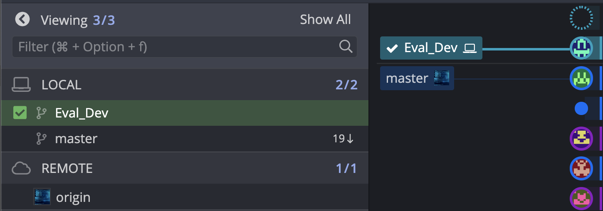
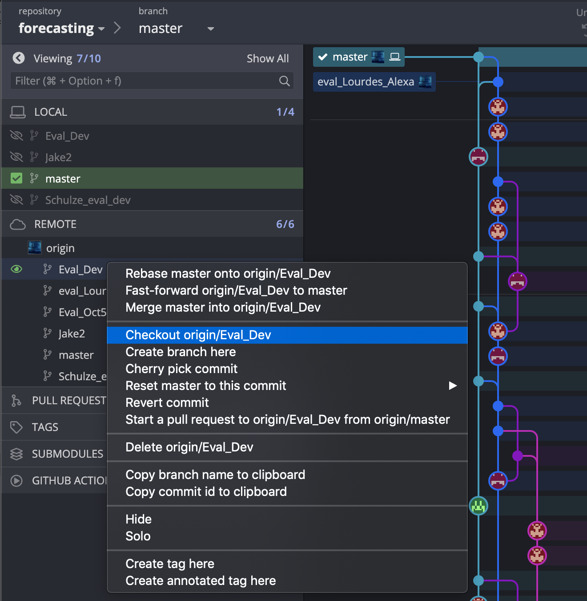
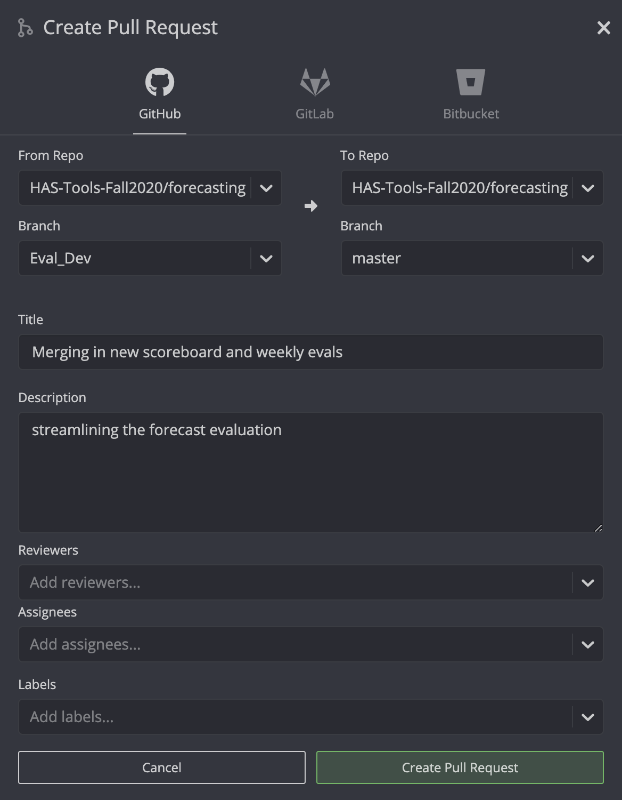

# Forecast evaluation
This folder contains the python scripts for doing forecast evaluation. When it is your week to be the evaluator you should follow the instructions below to score the forecasts.  Additionally you should modify the scripts here to provide some added functionality and if needed update the instructions for future forecast evaluators.

____
## Table of Contents:

1. [Evaluation Instructions](#evaluation)
  A description of the evaluation and python workflow. **Spend time understanding this workflow**.
2. [GitHub Instructions](#github)
  Specific instructions on how to interface with github during your evaluation adventure.

3. [Change Log](#changes)
  A log of changes that have been made to the `evaluation_scripts` folder each week. **You should update this** part of the document once you've made your desired functionality changes.


___
<a name="evaluation"></a>
## Evaluation Instructions

### Pre-Evaluation

1. **Install necessary Packages** To run these scripts you will need to first add the following to your hastools conda environment by doing the following from your shell:

 ```
 conda activate hastools
 conda install pip
 pip install dataretrieval

 conda install -c conda-forge seaborn
 ```

2. **Understand the Work Flow** Many python scripts and data inputs are used to evaluate forecasts. Make sure you understand (generally) what each script is doing. Note that making changes without understanding this bigger picture can cause hard-to-debug problems you weren't expecting. Before you make any changes, study the workflow described verbally and visually in the `Evaluation` section of the ReadMe (below) to understand how these


3. **Follow Shared-Repo Etiquette**
  * **Clean up after yourself.** Don't leave unnecessary files, figures, scripts, and notes in the `forecast` repo.
  * **Document you added functionality.** Be explicit and verbose in describing your changes
    1. Use descriptive 'commit' statements so that future forecast evaluators can best understand what changes you've made. (Not just - 'Week 12 is over, yay').
    2. As of Week 12, write a brief (3-4 sentence) description in the `change log` of the readme describing what changes you made to the forecast repo, which scripts you edited, what functions you created.
    3. Update the ReadMe with any changes to the forecasting workflow, for example if new scripts are needed or old ones are consolidated. Make these changes in the both the text of the readme, and also in the FlowChart.png. The latter can be edited in Powerpoint and Exported.
  * **Be Nice** Expect that previous evaluators have done the best they can, and don't hesitate to nicely ask for clarification if there's something you don't understand.


### Evaluation
0.  **Work on your added functionality**: Look through the scripts in this folder and add the functionality you would like. When you are done adding functionality you can do a pull request to merge your branch back in with the mater. **Be sure to coordinate with your partner and clarify direction with Laura before beginning to make any changes to this Repo.**



1. **Score the 1- and 2- week forecasts (after noon on Monday)***: Pull the latest updates from everyone and run the weekly forecast evaluation. Using the `score_weekly.py` script. You will need to update the following the forecast week to run this script. You can look that up in the `Seasonal_Forecast_Dates.pdf` file. For your week `#` this will create the `forecast_week#_results.csv` file in the directory `weekly_results`. Look at these results and the results that get printed from the script to see how everyone did.

****Note:*** If this is a team submission week, make sure to run `crosscheck_teams.py` to verify that all the forecasts are the same

2. **Assign Bonus points** After you do the scoring decide how you will assign bonus points. You should write your  own analysis script to determine how to assign bonus points you can save this  as  `Bonus_wk#.py`. **IMPORTANT: Your bonus script should end with the function `write_bonus` from the `eval_functions.py`.** This function writes the bonus point winners the file `bonus_week#.csv` in the directory `weekly_results`. See the bottom of the `Bonus_wk8.py` script for an example of how to do this.

3. **Calculate total scores** Run `Scoreboard.py` script to see the overall rankings and total scores. This will update `scoreboard.csv` and `score_details.csv`.

4. **Get 'true' average flow observations** Using the `Get_Observations.py` script, update the forecast week number and run the script to update the csv file containing the weekly average flows. This will update `weekly_observations.csv`.

5. **Compare the forecasts to 'truth', to date** After using `Get_Observations.py`. Update the week number in `forecast_analysis.py` and run the script to review the class performance of weekly forecasts to date. The `forecast_analysis.py` script will produce many types of graphs of everyone's 1 week and 2 week forecasts, so we can review everyone's performance to date.

### Post-Evaluation

6. **Document your added functionality** If any of your changes alter the instructions provided in this file update the instructions here so that people will be able to use your added functionality correctly. Remember: Be explicit and verbose in describing your changes
  1. Use descriptive 'commit' statements so that future forecast evaluators can best understand what changes you've made. (Not just - 'Week 12 is over, yay').
    2. As of Week 12, write a brief (3-4 sentence) description in the `change log` of the readme describing what changes you made to the forecast repo, which scripts you edited, what functions you created.
  3. Update the ReadMe with any changes to the forecasting workflow, for example if new scripts are needed or old ones are consolidated. Make these changes in the both the text of the readme, and also in the FlowChart.png. The latter can be edited in Powerpoint and Exported.

7. **Update the markdown file with your scores** update the README.md file in the main directory of this folder with the points you applied this week and the updated overall scores. This print statement should come out of the script `score_weekly.py`

___
<a name="github"></a>
## Github instructions
You will be using a  branching workflow for your feature development. To understand this workflow checkout [this link](https://www.atlassian.com/git/tutorials/comparing-workflows/feature-branch-workflow). I will walk you through it step by step here using GitKraken.

#### 1. Create a branch for your forecast evaluation work.
Note: if there are two of you you should just create **one branch**  one person should create the branch and then the other should checkout this branch.

#### If you are the person creating the branch:
 - first pull the forecast repo to make sure you are up to date and have the latest
 - Create a branch for your work by right clicking on the current master and selecting 'create branch here'. You will be prompted to name your branch -- name it whatever you want. I named mine "eval_dev"
 
 - When this is successfully done you will see that you are now working on your new branch and not the master. (Note you can always swap back to the master branch by selecting it from your local branches and 'checking it out')
 
 - The last step is to push this branch to GitHub so others can see it
 Click **Push** to push your branch to GitHub. When you do you will see a dialog that looks like this. Keep this set to 'origin' as shown here and select *submit*.
 

 #### If you are not the person creating the branch:
 - If you are the person who wants to use this branch you should see the new branch in your list of remote branches once the branch creator has followed the steps above. You just need to select the branch from the list of remote branches as shown below and click 'Checkout origin/NameofYourBranch'.
 

 - When this is successfully done you will see that you are now working on your new branch and not the master. (Note you can always swap back to the master branch by selecting it from your local branches and 'checking it out')
 

### 2. Make changes commit and push using you standard GitHub workflow.  
Follow your normal workflows exactly as you did before just this time you are pushing and pulling from the branch you created rather than master. Just make sure you coordinate with your partner so you don't create any conflicts if you are both trying to push changes to the same file.
 You can see that in the image below both my local and remote versions are up to date with the 'Eval_Dev' branch and the master branch is behind my changes.


### 3. When you are ready for me to review your code submit a pull request to merge your changes into the master repo. Before you do this make sure all of your changes are committed and pushed.
  - Right click on your branch and select 'start a pull request'
  
  - Fill out the information for your pull request.  Select me as your reviewer. Then say 'create pull request'
  
  - You can submit a pull request anytime you would like me to review your code. At the latest you should submit a request by Monday morning for your new functionality but I would encourage you to submit requests as early as possible along the way so I can give you feedback and you can make adjustments as needed.  

### 4. Finally when you are done with your development and your branch has been merged back into the master make sure you swap back to the master branch for your future work.  You do this just by checking out the master branch the same way you checked out your branch in the instructions above.

___
<a name="changes"></a>
## Change-Log

### Week 12:
  * Evaluators: bensketball and rhull21.
    * We 'git' organized by archiving old scripts, files, and folders
    * We update the python workflow documentation in the readme and provide a visual aid showing connections between scripts, inputs, and outputs.
    * We add some new plots (like `temp_comparison_plot` in `Score_Weekly.py` and update old ones by exporting them to the folder `all_charts`
    * We demand user-defined entry to `forecast_week` by using input boxes in `Get_Observations.py`, `forecast_analysis.py`, and `Score_Weekly.py`.


### Week 13:
  * Evaluators: Jill and Adam
    * We added code to `forecast_analysis.py` to calculate the top three leaders in three categories
      for seasonal forecast scoring:
           1) Lowest overall average seasonal RMSE
           2) Highest overall seasonal RMSE variance
           3) Three overall lowest singular RMSE values
